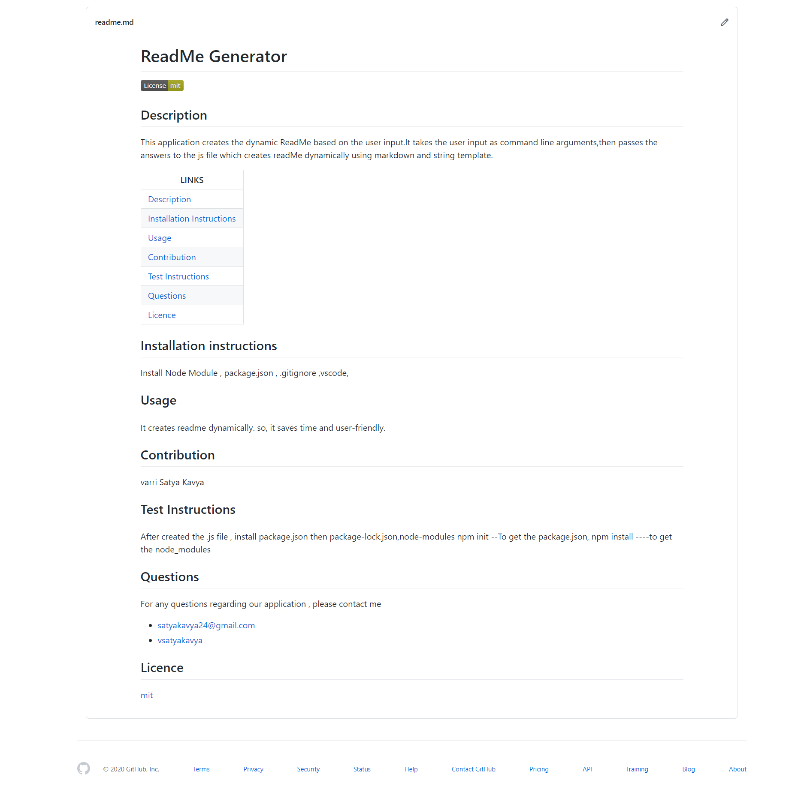

# ReadMe Generator 

  
 

# Application Does:
* Dynamic ReadMe Generator

# Technologies used:
*  JavaScript, Markdown , ES6

# Features:

* Generstes Dynamic ReadMe based on user input
* CLI Apllication
* Object Destructuring
* String Template
* Promises
* User-friendly  
* Saves user time 
* Sections of ReadMe are 
  * Title
  * Description, 
  * Table of Contents with Links
  * Installation instructions
  * Usage
  * Contribution
  * Tests
  * License
  * Badge of user selected License
  * Questions
    * Email ID
    * GitHub Profile Link
  

## To visit the Dynamically generated readMe ,Go to the Develop folder then click on  readme.md
  

# Challenges:
* Use promises
* Add links

# Sample Dynamic ReadMe

# Github Repository
https://github.com/vsatyakavya/ReadMeGenerator

# video link
 https://drive.google.com/file/d/1AOmNdaFKs59Ny0VG7nuc5XqIxbIgMnQ_/view
 
# contact Information
satyakavya24@gmail.com

@copyright 2020

